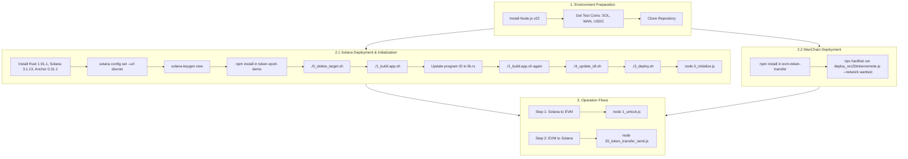

# Solana Xport Demo Flowchart

```mermaid
graph TD
    subgraph Prep [1. Environment Preparation]
        P1[Install Node.js v22] --> P2[Get Test Coins: SOL, WAN, USDC]
        P2 --> P3[Clone Repository]
    end

    subgraph Solana [2.1 Solana Deployment & Initialization]
        S1[Install Rust 1.91.1, Solana 3.1.13, Anchor 0.31.1] --> S2[solana config set --url devnet]
        S2 --> S3[solana-keygen new]
        S3 --> S4[npm install in token-xport-demo]
        S4 --> S5[./0_delete_target.sh]
        S5 --> S6[./1_build.app.sh]
        S6 --> S7[Update program ID in lib.rs]
        S7 --> S8[./1_build.app.sh again]
        S8 --> S9[./4_update_idl.sh]
        S9 --> S10[./3_deploy.sh]
        S10 --> S11[node 0_initialize.js]
    end

    subgraph Wan [2.2 WanChain Deployment]
        W1[npm install in evm-token-transfer] --> W2[npx hardhat run deploy_rec20tokenremote.js --network wantest]
    end

    subgraph Ops [3. Operation Flows]
        O1[Step 1: Solana to EVM] --> O2[node 1_unlock.js]
        O3[Step 2: EVM to Solana] --> O4[node 25_token_transfer_send.js]
    end

    Prep --> Solana
    Prep --> Wan
    Solana --> Ops
    Wan --> Ops
```
